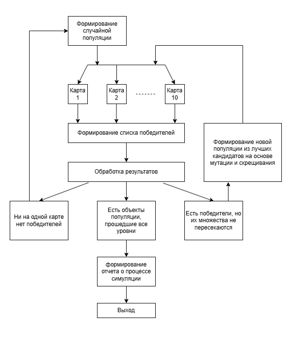

# Разработка 2D-игры на Godot Engine с использованием нейронных сетей
В рамках выполнения дипломной работы магистратуры НИУ ВШЭ по направлению "Машинное обучение и высоконагруженные системы" предполагается рассмотрение различных проблем, возникающих при разработке 
видеоигр (разработка уровней и проработка окружения). 

Рассматривается использование различных модификаций генеративно-состязательных сетей (GAN, от англ. Generative Adversarial Networks) для решения задачи генерации карт уровней. Освещены основные 
проблемы, возникающие при решении данного вопроса, а также предложены пути их решения. Рассмотрен вопрос об оценке качества сгенерированных изображений, к которым, в контексте разработки видеоигр, 
предъявляются дополнительные требования и ограничения. Для решения этой проблемы предлагается использовать обученных игровых агентов. В рамках работы разработана методология, способствующей быстрой
подготовке игровых агентов. Сам процесс обучения представляет собой гибридный подход, сочетающий обучение с подкреплением (RL, от англ. Reinforcement Learning) и эволюционные алгоритмы. Обученные
игровые агенты используются как судьи при оценке качества сгенерированного изображения уровня.

Для подготовки игровых агентов использовался фреймворк для разработки компьютерных игр – Godot Engine. Данное программное средство выступает не только как инструмент визуализации, но и непосредственн
служит программной средой, в которой осуществляется обучение RL-агентов.

# Концепт проекта
При разработке среды был выбран следующий концепт –  2D-поле с видом сверху, на котором размещается карта уровня. Карту уровня можно описать следующим образом: есть две области – область старта
и область финиша, соединенные цельной непрерывной дорогой без тупиковых ответвлений. Игровые агенты генерируются в области старта, их основная задача заключается без столкновения с краями дороги 
добраться до области финиша. Такой подход обладает относительной простотой реализации, но при этом хорошо визуализирует происходящие процессы. В качестве исходных данных, которые агенты получают
от среды и на основании которых принимают решения о своих дальнейших действиях, является информация о расстоянии агента до препятствий (краев дороги) по различным направлениям.

# Дорожная карта проекта
1. Изучение литературы по темы работы (1 апреля 2025 - 7 апреля 2025);
2. Обучения прохождения компьютером сгенерированных уровней на основе генетических подходов к обучению моделей (8 апреля 2025 - 21 апреля 2025);
3. Использование генеративно-состязательных моделей для решения задачи генерации уровней (22 апреля 2025 - 07 мая 2025);
4. Объединение результатов работы этапов 2, 3 и реализация конечного программного продукта (08 мая 2025 - 22 мая 2025);

# Этапы выполнения работы
## 1. Изучение литературы по теме работы:
Ниже представлен список основных источников информации, которые были использованы при выполнении данного проекта:
- [Generative Adversarial Nets](https://arxiv.org/abs/1406.2661);
- [Attention Is All You Need](https://arxiv.org/pdf/1706.03762);
- [Bootstrapping Conditional GANs For Video Game Level Generation](https://arxiv.org/abs/1910.01603);
- [Deep Learning of Neural Networks Using Genetic Algorithms](https://ceur-ws.org/Vol-3312/paper13.pdf);
- [Dota 2 with Large Scale Deep Reinforcement Learning](https://arxiv.org/abs/1912.06680);
- [Soft Actor-Critic: Off-Policy Maximum Entropy Deep Reinforcement Learning with a Stochastic Actor](https://arxiv.org/abs/1801.01290);
- [Godot Engine Documentation](https://docs.godotengine.org/en/stable/).

Список может быть дополнен.

## 2. Реализация подготовки игровых агентов на основе гибридных подходов, сочетающих RL- и генетические подходы к обучению моделей
Выполнения данного этапа работы предполагается непосредственно в среде разработки Godot, который обладает всем необходимым для этого функционалом.

Этап можно разделить на следующие части:
1. Создание изображений карт уровней, на которых будет производиться обучение;
   
   Примеры созданных изображений находятся . На данном этапе также реализован скрипт, который по исходным изображениям формата jpg создает
   аналогичные по структуре уровни в программной среде Godot для дальнейшего использования в обучении. Пример работы алгоритма представлен ниже:
   
   
2. Разработка игрового агента и выбор принципа, на котором будет производиться обучение;
   
   Игровой агент (моб) - это элементарный объект круглой формы под управлением компьютера. Его движение в каждый момент времени определяется вектором скорости (модуль и угол поворота).
   Для управления движением моба используется полносвязная нейронная сеть с одним скрытым слоем. На вход модели подается информация о расстоянии моба до стен карты
   (Godot располагает функционалом по отслеживанию расстояния до препятствий по заданным направлениям):
   
   
   Количество направлений, по которым производится отслеживание расстояний, а также их углы, являются гиперпараметрами и подбирались в процессе обучения. Каждый объект типа
   "моб" обладает областью мониторинга (окружность радиуса R), в пределах которой осуществляется детектирование препятствий. Если препятствия отсутствуют, то на вход нейронной
   сети подается нулевой вектор, при прямом контакте моба в препятствием по заданному направлению на соответствующий входной нейрон будет подана единица.

   На выходе модель выдает два значения - изменение модуля вектора скорости и угол его поворота. В качестве функции активации используется гиперболический тангенс
   (в силу специфики входных данных). На выходе для нормировки получаемых значений также используется гиперболический тангенс. Число нейронов входного и скрытого слоя являются
   гиперпараметрами и подбирались в процессе обучения. Обобщенная структурная схема нейронной сети, используемой в процессе обучения, представлена ниже:
   

   В силу специфики задачи, обучение модели стандартными методами с использованием функции потерь является затруднительным. Также неэффективны оказались классические RL-подходы.
   По этой причине было принято решение об использовании методов обучения на основе гибридных подходов, сочетающих обучение с подкреплением и генетические алгоритмы. В основе
   идеи работы генетических алгоритмов лежит понятие популяции и правило естественного отбора, которое гласит, что в
   следующее поколение популяции переходят только наиболее «сильные» ее особи. В контексте данной задачи, каждый объект популяции – это числовой вектор, хранящий веса
   ассоциированной с мобом нейронной сети. Для выявления наиболее «сильных» объектов популяции использовалась специально разработанная ScoreFunction, начисляющая очки
   объектам популяции за совершение различных действий в процессе моделирования. Объекты популяции, набравшие максимальное число очков по завершению симуляции становятся
   кандидатами для формирования следующей популяции. Формирование новой популяции осуществляется с помощью двух основных операций – скрещивание (объединение значений
   двух векторов) и мутация (случайное изменение некоторых значений исходного вектора):
   

4. Создание методологии обучения;
   
   Моб считается обученным, если он способен пройти все представленные для обучения карты уровней. С этой целью был разработан следующих подход к выбору кандидатов для
   формирования новой популяции:
   1. Популяция из N объектов генерируется случайным образом;
   2. Объекты популяции последовательно проходят все карты уровней, которые были предоставленны для обучения;
   3. После прохождения каждой карты формируется список объектов популяции, которые набрали наибольшее число очков с обязательным условие о достижении объектом популяции
   финишной точки карты уровня;
   4. Далее возможно три варинта развития событий:
      - ни один из объектов популяции не дошел до финиша ни на одной из карт, тогда популяция инициализируется заново случайным образом;
      - один или несколько объектов популяции прошли все имеющиеся уровни, тогда обучение завершается, прошедшие объекты популяции признаются "победителями",
        их веса записываются в текстовый файл для дальнейшего использования, процесс обучения завершается;
      - различные уровни прошли различные  объекты популяции, тогда формируется сет из победителей по каждому уровню и на его основе, с помощью скрещивания и мутации,
        формируется следующая популяция, и так  до тех пор, пока не случится пункт 2.
   5. Процесс продолжается до тех пор, пока не будет достигнуто условие для прерывания цикла.

   Весь описанный здесь процесс полностью был реализован средствами Godot Engine, что позволило добиться высокого уровня визуализации. Схематично, данный процесс можно представить следующим образом:
   
   
   

## 3. Использование генеративно-состязательный моделей для решения задачи генерации уровней
Можно выделить две основные проблемы, возникающие при решении задачи создания уровней для видеоигр с помощью генеративных моделей:
- крайне малое число обучающих данных (для отдельных видеоигр число обучающих примеров не превышать десяти);
- дополнительные требования, предъявляемые к создаваемым изображениям, обусловленные следующими факторами: требования по структурной целостности, возможное строгое количественное соответствие между элементами, а также соответствие изображения совокупности характеристик, описывающих играбельность сгенерированного уровня.

Для решения проблемы малого набора исходных данных, по которому происходит обучение, была использована итеративная процедура бутстрэппинга:
1. Выбранная модель обучается на малой исходной выборке;
2. Несмотря на то, что модель сильно переобучена, она используется для генерации большого набора данных (1000+ изображений уровней);
3. Сгенерированные изображения фильтруются и отбираются те, что признаются играбельными;
4. На основании экспертной оценки среди играбельных уровней отбираются те, что признаются уникальными, отличными от исходного обучающего набора данных;
5. Отобранные таким образом изображения добавляются в обучающий набор данных.

Использование классической модели GAN оказалось не очень эффективным. Модель сильно преробучалась и не улавливала глобальные зависимости между структурными элементами изображения. Результаты, полученные с пощью такой модели показаны ниже.

Использование модели SAGAN (модификации классического GAN, в которую добавлен модуль самовнимания) позволят решить главную проблему, с которой столкнулся GAN – уловить глобальные зависимости 
между структурными элементами изображения, которые сильно разведены в пространстве.
Глобавльно, структуры генератора и дискриминатора в рассматриваемой модели SAGAN аналогичны той, что использовались при обучения GAN'а, за исключением блока самовнимания.
Обучение модели SAGAN проводилось по итеративной процедуре бутстрэппинга. Результаты, продемонстрируемые этой моедлью, говорят о возможности исопльзования данного подхода для решения озвученных проблем:

Блок самовнимания позволил модели SAGAN уловить глобальные зависимости между структурными элементами изображения. Всего за несколько итерации алгоритма бутстрэппинга удалось добиться 
значительного повышения в количестве уникальных сгенерированных уровней.
Анализ созданных изображений показывает, что модель пытается создать новые уровни, соединяя между собой отдельные структурные элементы исходного обучающего набора.

## 4. Объединение результатов работы этапов 2, 3 и реализация конечного программного продукта
На основе работы, выполненной на различных этапах проекта, был сформирован исполняемый файл, представоляющий собой до полноценное самостоятельное приложение. 
Оно может быть использовано как интерактивно-обучающее программное средство для объяснения принципов работы генетических алгоритмов, как приложение подготовки 
RL-агентов, а также как иструмент для оценки качества сгенерированных уровней. Пример работы данной программы представлен .
Также, если добавить в приложение игрового агента под управлением человека и ввести соревновательную составляющую, данный проект можно довести до состояния 
полноценной видеоигр.
