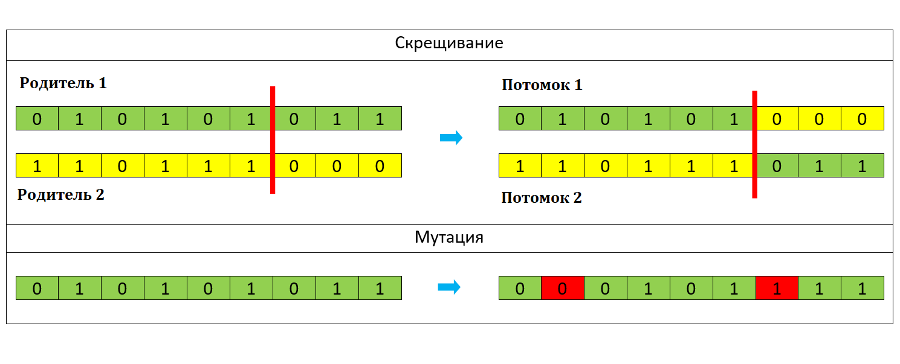

# Разработка 2D-игры на Godot Engine с использованием нейронных сетей
В рамках выполнения дипломной работы магистратуры НИУ ВШЭ по направлению "Машинное обучение и высоконагруженные системы" предполагается разработка приложения интерактивно-обучающей направленности.
Разработка приложения ведется при помощи программного обеспечения для разработки компьютерных игр - Godot Engine. Особенностью проекта является интегрирование нейростевых подходов для реализации
основных компонентов проекта. 

# Краткое описание проекта
Предполагается разработка 2D-игры  в жанре "roguelike". Каждый уровень - это 2d-карта лабиринта с видом сверху, основная задача игрока - пройти от точки "старт" до точки "финиш" быстрее, чем это сделает
компьютер. Исходя из такого описания, проект можно разбить на две основные части - генерация уровней и обучение компьютера проходить эти сгенерированные уровни. Генерацию карт уровней предлагается
осуществлять с помощью генеративно-состязательной модели с модулем внимания и conditional-вектором. Для создания приложения используется программное обеспечение для разработки компьютерных игр -
Godot Engine.

# Дорожная карта проекта
1. Изучение литературы по темы работы (1 апреля 2025 - 7 апреля 2025);
2. Обучения прохождения компьютером сгенерированных уровней на основе генетических подходов к обучению моделей (8 апреля 2025 - 21 апреля 2025);
3. Реализация генеративно-состязательной модели CESAGAN для генерации уровней (22 апреля 2025 - 07 мая 2025);
4. Объединение результатов работы этапов 2, 3 и реализация конечного программного продукта (08 мая 2025 - 15 мая 2025);
5. Реализация сервисной части проекта (16 мая 2025 - 22 мая 2025).

# Этапы выполнения работы
## 1. Изучение литературы по теме работы:
Ниже представлен список основных источников информации, которые были использованы при выполнении данного проекта:
- [Generative Adversarial Nets](https://arxiv.org/abs/1406.2661);
- [Attention Is All You Need](https://arxiv.org/pdf/1706.03762);
- [Bootstrapping Conditional GANs For Video Game Level Generation](https://arxiv.org/abs/1910.01603);
- [Deep Learning of Neural Networks Using Genetic Algorithms](https://ceur-ws.org/Vol-3312/paper13.pdf);
- [Godot Engine Documentation](https://docs.godotengine.org/en/stable/).

Список может быть дополнен.

## 2. Реализация процесса обучения прохождения компьютером сгенерированных уровней на основе генетических подходов к обучению моделей
Выполнения данного этапа работы предполагается непосредственно в среде разработки Godot, который обладает всем необходимым для этого функционалом.

Этап можно разделить на следующие части:
1. Создание изображений карт уровней, на которых будет производиться обучение;
   
   Примеры созданных изображений находятся в папке ... На данном этапе также реализован скрипт, который по исходным изображениям формата jpg создает
   аналогичные по структуре уровни в программной среде Godot для дальнейшего использования в обучении. Пример работы алгоритма представлен ниже:
   
   
2. Разработка модели "моба" под управлением компьютера и выбор принципа, на котором будет производиться обучение;
   
   Моб - это элементарный объект круглой формы под управлением компьютера. Его движение в каждый момент времени определяется вектором скорости (модуль и угол поворота).
   Для управления движением моба используется полносвязная нейронная сеть с одним скрытым слоем. На вход модели подается информация о расстоянии моба до стен карты
   (Godot располагает функционалом по отслеживанию расстояния до препятствий по заданным направлениям):
   
   Количество направлений, по которым производится отслеживание расстояний, а также их углы, являются гиперпараметрами и подбирались в процессе обучения. Каждый объект типа
   "моб" обладает областью мониторинга (окружность радиуса R), в пределах которой осуществляется детектирование препятствий. Если препятствия отсутствуют, то на вход нейронной
   сети подается нулевой вектор, при прямом контакте моба в препятствием по заданному направлению на соответствующий входной нейрон будет подана единица.

   На выходе модель выдает два значения - изменение модуля вектора скорости и угол его поворота. В качестве функции активации используется гиперболический тангенс
   (в силу специфики входных данных). На выходе для нормировки получаемых значений также используется гиперболический тангенс. Число нейронов входного и скрытого слоя являются
   гиперпараметрами и подбирались в процессе обучения. Обобщенная структурная схема нейронной сети, используемой в процессе обучения, представлена ниже:
   

   В силу специфики задачи, обучение модели стандартными методами с использованием функции потерь является затруднительным. По этой причине было принято решение об
   использовании методов обучения на основе генетических алгоритмов. В основе данного подхода лежит понятие популяции и правило естественного отбора, которое гласит, что в
   следующее поколение популяции переходят только наиболее «сильные» ее особи. В контексте данной задачи, каждый объект популяции – это числовой вектор, хранящий веса
   ассоциированной с мобом нейронной сети. Для выявления наиболее «сильных» объектов популяции использовалась специально разработанная ScoreFunction, начисляющая очки
   объектам популяции за совершение различных действий в процессе моделирования. Объекты популяции, набравшие максимальное число очков по завершению симуляции становятся
   кандидатами для формирования следующей популяции. Формирование новой популяции осуществляется с помощью двух основных операций – скрещивание (объединение значений
   двух векторов) и мутация (случайное изменение некоторых значений исходного вектора):
   

4. Создание методологии обучения;
5. Реализация функционала внутренними средствами Godot Engine.

## 3. Реализация генеративно-состязательной модели CESAGAN для генерации уровней
Этап в процессе выполнения.

## 4. Объединение результатов работы этапов 2, 3 и реализация конечного программного продукта
Этап в процессе выполнения.

## 5. Реализация сервисной части проекта
Программное обеспечение для разработки компьютерных игр - Godot Engine - располагает встроенным функционалом для экспортирования разработанного продукта. На данном этапе была выполнена разработка
и проверка тестового варианта программы с целью проверки имеющегося функционала. Программу успешно удалось экспортировать на операционные системы Windows, Linux, MacOS. Также планируется создание
web-версии разработанного программного продукта.

Данный раздел будет дополняться.
